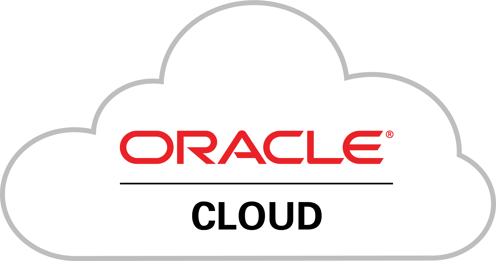

### Hi there 👋 .... welcome to my github landing page!

 

My name is D, I'm a Customer Engineer at Google

Specialist in Infrastructure and Application Modernization. 

---

### Technology expertise 

 

---
<h2> Hobbies </h2>
I enjoy playing PS5. Send me a message and we can connect on PSPlus!

