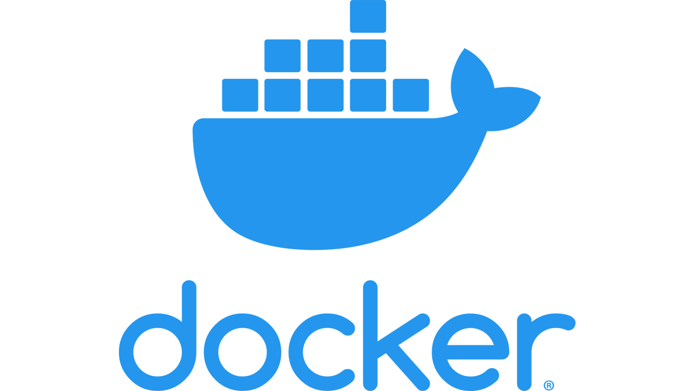

### Hi there 👋 .... welcome to my github landing page!

 
 
 

My name is Denny, I'm a Cloud Architect at Oracle for Startups

I currently lead the CloudBricks project available on https://github.com/oracle-devrel/ Feel free to contribute to it!

---

 |Programming languages and Technology expertise|

<a href="https://spring.io/projects/spring-boot">

</a>

 

---
<h2> Let's connect </h2>

 

---
<h2> Hobbies </h2>
I enjoy playing PS5. Send me a message and we can connect on PSPlus!

